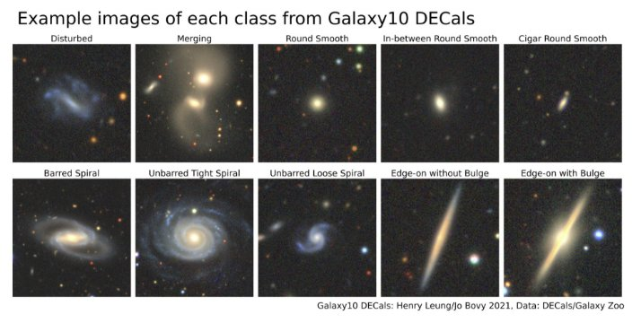
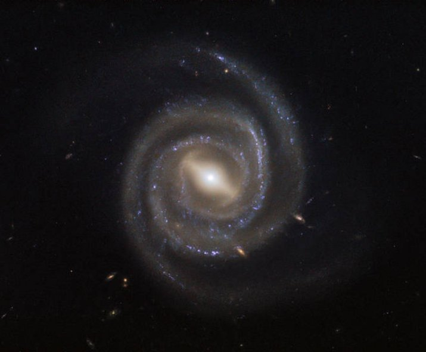

**Galaxy Classification Using Convolutional Neural Network**

**Our night sky is filled with billions of galaxies, each with billions of stars. With new technoly we are able to make telescopes that can probe even the farthest of the galaxies that were born just after the big bang. But analysing all the night sky is very difficult so we have to pick out targets wisely. I propose a pipeline where the telescope data can be fed in and it will automatically classify the object based on their morphology or spectrum or anything that can be useful for the scientists. So here i have created the most crutial step of the pipeline, the classifier.**

**The original Galaxy10 dataset was created with Galaxy Zoo (GZ) Data Release 2 where volunteers classify ~270k of SDSS galaxy images where ~22k of those images were selected in 10 broad classes using volunteer votes. GZ later utilized images from DESI Legacy Imaging Surveys (DECals) with much better resolution and image quality. Galaxy10 DECals has combined all three (GZ DR2 with DECals images instead of SDSS images and DECals campaign ab, c) results in ~441k of unique galaxies covered by DECals where ~18k of those images were selected in 10 broad classes using volunteer votes with more rigorous filtering. Galaxy10 DECals had its 10 broad classes tweaked a bit so that each class is more distinct from each other and Edge-on Disk with Boxy Bulge class with only 17 images in original Galaxy10 was abandoned. The source code for this dataset is released under this repositary so you are welcome to play around if you like, otherwise you can use the compiled Galaxy10 DECals with dowload link below.**

**Galaxy10\_DECals.h5: [https://astro.utoronto.ca/~hleung/shared/Galaxy10/Galaxy10_DECals.h5**](https://astro.utoronto.ca/~hleung/shared/Galaxy10/Galaxy10_DECals.h5)**

**Galaxy10 DECals is a dataset contains 17736 256x256 pixels colored galaxy images (g, r and z band) separated in 10 classes. Galaxy10\_DECals.h5 have columns images with shape (17736, 256, 256, 3), ans, ra, dec, redshift and pxscale in unit of arcsecond per pixel**

**Importing required library**

In [2]:

!pip install h5py

Requirement already satisfied: h5py in c:\users\user\anaconda3\lib\site-packages (3.2.1) Requirement already satisfied: numpy>=1.19.0 in c:\users\user\anaconda3\lib\site-packages (from h5py) (1.20.3)

In [4]:

import h5py

import numpy as np

from tensorflow.keras import utils

**Collecting the Image data**

**The data is stored in .h5 file format. So here I am using h5py library to open the image data and storing it in a numpy array.**

In [41]:

with h5py.File('../Data/Galaxy10\_DECals.h5','r') as F:     images = np.array(F['images'])

`    `labels = np.array(F['ans'])

In [6]:

import PIL

import matplotlib.pyplot as plt import random

**Labels**

In [7]:

label\_names = ['Disturbed Galaxy',

`               `'Merging Galaxy',

`               `'Round Smooth Galaxy',

`               `'In-between Round Smooth Galaxy',                'Cigar Shaped Smooth Galaxy',

`               `'Barred Spiral Galaxy',

`               `'Unbarred Tight Spiral Galaxy',                'Unbarred Loose Spiral Galaxy',                'Edge-on Galaxy without Bulge',                'Edge-on Galaxy with Bulge'

`              `]

**Data Visualization**

**Here I have selected 16 images randomly from the dataset and they are displayed using** 

matplotlib.pyplot.imshow **.**

In [8]:

plt.figure(figsize=(13,13))

for i in range(16):

`    `index = random.randint(0,17736)

`    `image = images[index]

`    `plt.subplot(4,4,i + 1)

`    `plt.imshow(image)

`    `plt.title(label\_names[labels[index]])     plt.axis('off')

In [9]: labels.shape Out[9]: (17736,)

**Spliting the data Into Test and Traning set**

**Here I have used sci-kit learn library to split the numpy data into training and testing set. The ratio of training and testing set is 5:1.**

In [10]:

from sklearn.model\_selection import train\_test\_split

In [11]:

train\_idx, test\_idx = train\_test\_split(np.arange(labels.shape[0]), test\_size = 0.2)

In [12]:

train\_images, train\_labels, test\_images, test\_labels = images[train\_idx], labels[train\_i dx], images[test\_idx], labels[test\_idx]

In [13]:

print(train\_images.shape[0], test\_images.shape[0]) 14188 3548

In [14]: images.shape

Out[14]:

Out[14]:

(17736, 256, 256, 3)

**Preparing the dataset**

In [42]:

import tensorflow as tf

img\_height = 256 img\_width = 256

In [18]:

class\_names = label\_names

In [19]:

train\_dataset = tf.data.Dataset.from\_tensor\_slices((train\_images, train\_labels)) test\_dataset = tf.data.Dataset.from\_tensor\_slices((test\_images, test\_labels))

In [20]:

BATCH\_SIZE = 50 SHUFFLE\_BUFFER\_SIZE = 1000

In [21]:

train\_dataset = train\_dataset.shuffle(SHUFFLE\_BUFFER\_SIZE).batch(BATCH\_SIZE) test\_dataset = test\_dataset.batch(BATCH\_SIZE)

In [22]: EPOCHS = 5

**Standardise the data**

**The RGB channel values are in the**  [0, 255] **range. This is not ideal for a neural network; in general we should seek to make your input values small.**

**Here, I have standardize values to be in the**  [0, 1] **range by using**  tf.keras.layers.Rescaling **:**

In [23]:

AUTOTUNE = tf.data.AUTOTUNE

train\_dataset = train\_dataset.cache().shuffle(1000).prefetch(buffer\_size=AUTOTUNE) test\_dataset = test\_dataset.cache().prefetch(buffer\_size=AUTOTUNE)

In [24]:

from tensorflow.keras import layers normalization\_layer = layers.Rescaling(1./255)

In [25]:

normalized\_dataset = train\_dataset.map(lambda x,y: (normalization\_layer(x),y)) images\_batch, labels\_batch = next(iter(normalized\_dataset))

In [26]:

num\_classes = len(class\_names)

**Creating the model**

**The Sequential model consists of three convolution blocks (**tf.keras.layers.Conv2D **) with a max pooling layer (**tf.keras.layers.MaxPooling2D **) in each of them. There's a fully-connected layer (**tf.keras.layers.Dense **) with 128 units on top of it that is activated by a ReLU activation function (** 'relu' **). This model has not been tuned for high accuracy—the goal of this tutorial is to show a standard approach.**

**Below is an image to understand how neural network works, but instead of classifying animals we are classifying galaxies.**

In [28]:

from tensorflow.keras.models import Sequential

model = Sequential([

`    `layers.Rescaling(1./255, input\_shape=(img\_height, img\_width, 3)),     layers.Conv2D(16, 3, padding='same', activation='relu'),

`    `layers.MaxPooling2D(),

`    `layers.Conv2D(32, 3, padding='same', activation='relu'),

`    `layers.MaxPooling2D(),

`    `layers.Conv2D(64, 3, padding='same', activation='relu'),

`    `#layers.MaxPooling2D(),

`    `#layers.Conv2D(128, 3, padding='same', activation='relu'),

`    `layers.MaxPooling2D(),

`    `layers.Flatten(),

`    `layers.Dense(128, activation='relu'),

`    `layers.Dense(num\_classes)

])

In [25]:

model.compile(optimizer='adam', loss=tf.keras.losses.SparseCategoricalCrossentropy(from\_ logits=True),metrics=['accuracy'])

**Summary of the model**

**Here you can se all the hidden layers and their shapes, and total numbers of parameters after each layers is also shown.**

In [26]: model.summary()

Model: "sequential" \_\_\_\_\_\_\_\_\_\_\_\_\_\_\_\_\_\_\_\_\_\_\_\_\_\_\_\_\_\_\_\_\_\_\_\_\_\_\_\_\_\_\_\_\_\_\_\_\_\_\_\_\_\_\_\_\_\_\_\_\_\_\_\_\_  Layer (type)                Output Shape              Param #   =================================================================

` `rescaling\_1 (Rescaling)     (None, 256, 256, 3)       0         

` `conv2d (Conv2D)             (None, 256, 256, 16)      448       

` `max\_pooling2d (MaxPooling2D  (None, 128, 128, 16)     0          )                                                               

` `conv2d\_1 (Conv2D)           (None, 128, 128, 32)      4640      

` `max\_pooling2d\_1 (MaxPooling  (None, 64, 64, 32)       0          2D)                                                             

` `conv2d\_2 (Conv2D)           (None, 64, 64, 64)        18496     

` `max\_pooling2d\_2 (MaxPooling  (None, 32, 32, 64)       0          2D)                                                             

` `flatten (Flatten)           (None, 65536)             0          dense (Dense)               (None, 128)               8388736    dense\_1 (Dense)             (None, 10)                1290      

================================================================= Total params: 8,413,610

Trainable params: 8,413,610

Non-trainable params: 0 \_\_\_\_\_\_\_\_\_\_\_\_\_\_\_\_\_\_\_\_\_\_\_\_\_\_\_\_\_\_\_\_\_\_\_\_\_\_\_\_\_\_\_\_\_\_\_\_\_\_\_\_\_\_\_\_\_\_\_\_\_\_\_\_\_

**Training the model**

**I haved trained the model for 5 epochs to see how the model behaves.** In [27]:

EPOCHS = 5

history = model.fit(

`    `train\_dataset, 

`    `validation\_data = test\_dataset,     epochs = EPOCHS

)

Epoch 1/5

284/284 [==============================] - 20s 49ms/step - loss: 2.0042 - accuracy: 0.244 7 - val\_loss: 1.7909 - val\_accuracy: 0.3174

Epoch 2/5

284/284 [==============================] - 13s 44ms/step - loss: 1.6224 - accuracy: 0.400 7 - val\_loss: 1.4915 - val\_accuracy: 0.4501

Epoch 3/5

284/284 [==============================] - 13s 44ms/step - loss: 1.2760 - accuracy: 0.538 9 - val\_loss: 1.4778 - val\_accuracy: 0.4749

Epoch 4/5

284/284 [==============================] - 13s 44ms/step - loss: 1.0344 - accuracy: 0.632 4 - val\_loss: 1.3889 - val\_accuracy: 0.5172

Epoch 5/5

284/284 [==============================] - 13s 45ms/step - loss: 0.8017 - accuracy: 0.719 8 - val\_loss: 1.4810 - val\_accuracy: 0.5285

**Visualising the training results**

In [28]:

acc = history.history['accuracy'] val\_acc = history.history['val\_accuracy']

loss = history.history['loss'] val\_loss = history.history['val\_loss']

epochs\_range = range(EPOCHS)

plt.figure(figsize=(8, 8))

plt.subplot(1, 2, 1)

plt.plot(epochs\_range, acc, label='Training Accuracy') plt.plot(epochs\_range, val\_acc, label='Validation Accuracy') plt.legend(loc='lower right')

plt.title('Training and Validation Accuracy')

plt.subplot(1, 2, 2)

plt.plot(epochs\_range, loss, label='Training Loss') plt.plot(epochs\_range, val\_loss, label='Validation Loss') plt.legend(loc='upper right')

plt.title('Training and Validation Loss')

plt.show()

**Overfitting**

**In the plots above, the training accuracy is increasing linearly over time, whereas validation accuracy stalls around 60% in the training process. Also, the difference in accuracy between training and validation accuracy is noticeable—a sign of overfitting.**

**When there are a small number of training examples, the model sometimes learns from noises or unwanted details from training examples—to an extent that it negatively impacts the performance of the model on new examples. This phenomenon is known as overfitting. It means that the model will have a difficult time generalizing on a new dataset.**

**There are multiple ways to fight overfitting in the training process.**

- **Data Augmentation**
  - **Dropout layer.**

**Testing the results**

**Here I have used a barred spiral galaxy image and the model is able to pridict it correctly, But not always. We need to improve the model.**

In [29]:

In [29]:

from tensorflow import keras

from tensorflow.keras import utils

barred\_spiral\_img = tf.keras.utils.load\_img('../Data/new\_test\_data/barred\_spiral\_test1.pn g', target\_size = (img\_height, img\_width)) PIL.Image.open('../Data/new\_test\_data/barred\_spiral\_test1.png')

Out[29]:

In [30]:

img\_array = tf.keras.utils.img\_to\_array(barred\_spiral\_img) img\_array = tf.expand\_dims(img\_array, 0)

In [31]:

prediction = model.predict(img\_array)

In [32]:

score = tf.nn.softmax(prediction[0])

In [33]:

for i in score: print(i)

tf.Tensor(0.07197627, shape=(), dtype=float32) tf.Tensor(0.059918653, shape=(), dtype=float32) tf.Tensor(0.0040735723, shape=(), dtype=float32) tf.Tensor(0.0020373825, shape=(), dtype=float32) tf.Tensor(4.951063e-06, shape=(), dtype=float32) tf.Tensor(0.77023846, shape=(), dtype=float32) tf.Tensor(0.0071348613, shape=(), dtype=float32)

tf.Tensor(0.0071348613, shape=(), dtype=float32) tf.Tensor(0.08411451, shape=(), dtype=float32) tf.Tensor(8.2698214e-05, shape=(), dtype=float32) tf.Tensor(0.00041850048, shape=(), dtype=float32)

In [34]:

print('This galaxy is most likely to be a ' + str(class\_names[np.argmax(score)]) + '.') This galaxy is most likely to be a Barred Spiral Galaxy.

**Data Augmentation**

**Overfitting generally occurs when there are a small number of training examples. Data augmentation takes the approach of generating additional training data from your existing examples by augmenting them using random transformations that yield believable-looking images. This helps expose the model to more aspects of the data and generalize better.**

**I will implement data augmentation using the following Keras preprocessing layers:** 

tf.keras.layers.RandomFlip **,** tf.keras.layers.RandomRotation **, **

tf.keras.layers.RandomTranslation **, and** tf.keras.layers.RandomZoom **. These can be included inside your model like other layers, and run on the GPU.**

In [29]:

zoom\_factor = (-0.1,0.5)

data\_augmentation = Sequential([

`    `layers.RandomFlip('horizontal\_and\_vertical',input\_shape=(img\_height, img\_width, 3)),     layers.RandomRotation(0.5),

`    `#layers.RandomZoom(height\_factor=zoom\_factor, width\_factor=zoom\_factor),

`    `layers.RandomZoom((-0.5,0.1),fill\_mode='wrap'),

`    `layers.RandomTranslation(0.08,0.08)#, fill\_mode='wrap')

])

In [40]:

plt.figure(figsize=(10, 10))

for images, \_ in train\_dataset.take(1):

`  `for i in range(9):

`    `augmented\_images = data\_augmentation(images)

`    `ax = plt.subplot(3, 3, i + 1)

`    `plt.imshow(augmented\_images[0].numpy().astype("uint8"))     plt.axis("off")

**Dropout**

In [37]:

model = Sequential([

`    `data\_augmentation,

`    `layers.Rescaling(1./255, input\_shape=(img\_height, img\_width, 3)),     layers.Conv2D(16, 3, padding='same', activation='relu'),

`    `layers.MaxPooling2D(),

`    `layers.Conv2D(32, 3, padding='same', activation='relu'),

`    `layers.MaxPooling2D(),

`    `layers.Conv2D(64, 3, padding='same', activation='relu'),

`    `layers.MaxPooling2D(),

`    `layers.Conv2D(128, 3, padding='same', activation='relu'),

`    `layers.MaxPooling2D(),

`    `layers.Dropout(0.2),

`    `layers.Flatten(),

`    `layers.Dense(256, activation='relu'),

`    `layers.Flatten(),

`    `layers.Dense(128, activation='relu'),

`    `layers.Dense(num\_classes)

])

In [38]:

model.compile(optimizer='adam', loss=tf.keras.losses.SparseCategoricalCrossentropy(from\_ logits=True),

`             `metrics=['accuracy'])

In [39]: EPOCHS = 100

In [40]: model.summary()

Model: "sequential\_2" \_\_\_\_\_\_\_\_\_\_\_\_\_\_\_\_\_\_\_\_\_\_\_\_\_\_\_\_\_\_\_\_\_\_\_\_\_\_\_\_\_\_\_\_\_\_\_\_\_\_\_\_\_\_\_\_\_\_\_\_\_\_\_\_\_  Layer (type)                Output Shape              Param #   =================================================================  sequential\_1 (Sequential)   (None, 256, 256, 3)       0         

` `rescaling\_2 (Rescaling)     (None, 256, 256, 3)       0          conv2d\_3 (Conv2D)           (None, 256, 256, 16)      448       

` `max\_pooling2d\_3 (MaxPooling  (None, 128, 128, 16)     0          2D)                                                             

` `conv2d\_4 (Conv2D)           (None, 128, 128, 32)      4640      

` `max\_pooling2d\_4 (MaxPooling  (None, 64, 64, 32)       0          2D)                                                             

` `conv2d\_5 (Conv2D)           (None, 64, 64, 64)        18496     

` `max\_pooling2d\_5 (MaxPooling  (None, 32, 32, 64)       0          2D)                                                             

` `conv2d\_6 (Conv2D)           (None, 32, 32, 128)       73856     

` `conv2d\_6 (Conv2D)           (None, 32, 32, 128)       73856     

` `max\_pooling2d\_6 (MaxPooling  (None, 16, 16, 128)      0          2D)                                                             

` `dropout (Dropout)           (None, 16, 16, 128)       0          flatten\_1 (Flatten)         (None, 32768)             0          dense\_2 (Dense)             (None, 256)               8388864    flatten\_2 (Flatten)         (None, 256)               0          dense\_3 (Dense)             (None, 128)               32896     

` `dense\_4 (Dense)             (None, 10)                1290      

================================================================= Total params: 8,520,490

Trainable params: 8,520,490

Non-trainable params: 0 \_\_\_\_\_\_\_\_\_\_\_\_\_\_\_\_\_\_\_\_\_\_\_\_\_\_\_\_\_\_\_\_\_\_\_\_\_\_\_\_\_\_\_\_\_\_\_\_\_\_\_\_\_\_\_\_\_\_\_\_\_\_\_\_\_

In [41]:

history = model.fit(train\_dataset,

`                   `validation\_data= test\_dataset,                    epochs=EPOCHS)

Epoch 1/100

284/284 [==============================] - 19s 60ms/step - loss: 1.9943 - accuracy: 0.250 5 - val\_loss: 1.8324 - val\_accuracy: 0.3126

Epoch 2/100

284/284 [==============================] - 16s 57ms/step - loss: 1.6606 - accuracy: 0.377 1 - val\_loss: 1.4974 - val\_accuracy: 0.4462

Epoch 3/100

284/284 [==============================] - 16s 58ms/step - loss: 1.4607 - accuracy: 0.453 8 - val\_loss: 1.4886 - val\_accuracy: 0.4346

Epoch 4/100

284/284 [==============================] - 16s 57ms/step - loss: 1.3698 - accuracy: 0.492 2 - val\_loss: 1.3908 - val\_accuracy: 0.4963

Epoch 5/100

284/284 [==============================] - 16s 58ms/step - loss: 1.2978 - accuracy: 0.524 5 - val\_loss: 1.3375 - val\_accuracy: 0.5025

Epoch 6/100

284/284 [==============================] - 16s 57ms/step - loss: 1.2314 - accuracy: 0.552 2 - val\_loss: 1.1787 - val\_accuracy: 0.5753

Epoch 7/100

284/284 [==============================] - 17s 59ms/step - loss: 1.1405 - accuracy: 0.587 0 - val\_loss: 1.0567 - val\_accuracy: 0.6198

Epoch 8/100

284/284 [==============================] - 17s 59ms/step - loss: 1.0823 - accuracy: 0.612 8 - val\_loss: 1.0248 - val\_accuracy: 0.6370

Epoch 9/100

284/284 [==============================] - 16s 57ms/step - loss: 1.0062 - accuracy: 0.642 7 - val\_loss: 0.9466 - val\_accuracy: 0.6719

Epoch 10/100

284/284 [==============================] - 16s 58ms/step - loss: 0.9776 - accuracy: 0.656 3 - val\_loss: 0.9351 - val\_accuracy: 0.6702

Epoch 11/100

284/284 [==============================] - 16s 58ms/step - loss: 0.9364 - accuracy: 0.671 1 - val\_loss: 1.0565 - val\_accuracy: 0.6234

Epoch 12/100

284/284 [==============================] - 16s 57ms/step - loss: 0.9026 - accuracy: 0.684 1 - val\_loss: 0.9389 - val\_accuracy: 0.6719

Epoch 13/100

284/284 [==============================] - 16s 58ms/step - loss: 0.8915 - accuracy: 0.685 5 - val\_loss: 0.8972 - val\_accuracy: 0.6843

Epoch 14/100

284/284 [==============================] - 16s 58ms/step - loss: 0.8698 - accuracy: 0.695 8 - val\_loss: 0.8073 - val\_accuracy: 0.7145

Epoch 15/100

284/284 [==============================] - 16s 57ms/step - loss: 0.8608 - accuracy: 0.699 284/284 [==============================] - 16s 57ms/step - loss: 0.8608 - accuracy: 0.699 0 - val\_loss: 0.8737 - val\_accuracy: 0.6908

Epoch 16/100

284/284 [==============================] - 16s 58ms/step - loss: 0.8342 - accuracy: 0.710 8 - val\_loss: 0.7918 - val\_accuracy: 0.7252

Epoch 17/100

284/284 [==============================] - 16s 58ms/step - loss: 0.8382 - accuracy: 0.708 4 - val\_loss: 0.8312 - val\_accuracy: 0.7134

Epoch 18/100

284/284 [==============================] - 16s 57ms/step - loss: 0.8208 - accuracy: 0.712 5 - val\_loss: 0.8034 - val\_accuracy: 0.7103

Epoch 19/100

284/284 [==============================] - 16s 58ms/step - loss: 0.8000 - accuracy: 0.719 8 - val\_loss: 0.7638 - val\_accuracy: 0.7283

Epoch 20/100

284/284 [==============================] - 16s 57ms/step - loss: 0.7873 - accuracy: 0.723 6 - val\_loss: 0.7911 - val\_accuracy: 0.7275

Epoch 21/100

284/284 [==============================] - 16s 58ms/step - loss: 0.7922 - accuracy: 0.723 6 - val\_loss: 0.8206 - val\_accuracy: 0.7066

Epoch 22/100

284/284 [==============================] - 16s 58ms/step - loss: 0.7693 - accuracy: 0.732 8 - val\_loss: 0.7656 - val\_accuracy: 0.7325

Epoch 23/100

284/284 [==============================] - 16s 57ms/step - loss: 0.7663 - accuracy: 0.731 1 - val\_loss: 0.7168 - val\_accuracy: 0.7497

Epoch 24/100

284/284 [==============================] - 16s 58ms/step - loss: 0.7605 - accuracy: 0.732 6 - val\_loss: 0.6867 - val\_accuracy: 0.7630

Epoch 25/100

284/284 [==============================] - 16s 57ms/step - loss: 0.7606 - accuracy: 0.737 4 - val\_loss: 0.7477 - val\_accuracy: 0.7410

Epoch 26/100

284/284 [==============================] - 16s 57ms/step - loss: 0.7391 - accuracy: 0.743 1 - val\_loss: 0.7636 - val\_accuracy: 0.7356

Epoch 27/100

284/284 [==============================] - 16s 58ms/step - loss: 0.7460 - accuracy: 0.738 9 - val\_loss: 0.7563 - val\_accuracy: 0.7444

Epoch 28/100

284/284 [==============================] - 16s 58ms/step - loss: 0.7384 - accuracy: 0.737 2 - val\_loss: 0.7704 - val\_accuracy: 0.7418

Epoch 29/100

284/284 [==============================] - 16s 57ms/step - loss: 0.7229 - accuracy: 0.750 2 - val\_loss: 0.7855 - val\_accuracy: 0.7266

Epoch 30/100

284/284 [==============================] - 16s 57ms/step - loss: 0.7243 - accuracy: 0.750 7 - val\_loss: 0.6959 - val\_accuracy: 0.7610

Epoch 31/100

284/284 [==============================] - 17s 59ms/step - loss: 0.7193 - accuracy: 0.751 3 - val\_loss: 0.7416 - val\_accuracy: 0.7362

Epoch 32/100

284/284 [==============================] - 16s 57ms/step - loss: 0.7179 - accuracy: 0.749 6 - val\_loss: 0.6834 - val\_accuracy: 0.7596

Epoch 33/100

284/284 [==============================] - 16s 57ms/step - loss: 0.7061 - accuracy: 0.754 9 - val\_loss: 0.6591 - val\_accuracy: 0.7675

Epoch 34/100

284/284 [==============================] - 16s 57ms/step - loss: 0.7047 - accuracy: 0.755 5 - val\_loss: 0.6575 - val\_accuracy: 0.7765

Epoch 35/100

284/284 [==============================] - 16s 56ms/step - loss: 0.7041 - accuracy: 0.756 1 - val\_loss: 0.6487 - val\_accuracy: 0.7754

Epoch 36/100

284/284 [==============================] - 16s 57ms/step - loss: 0.6906 - accuracy: 0.755 8 - val\_loss: 0.6476 - val\_accuracy: 0.7740

Epoch 37/100

284/284 [==============================] - 18s 63ms/step - loss: 0.6845 - accuracy: 0.763 3 - val\_loss: 0.7185 - val\_accuracy: 0.7466

Epoch 38/100

284/284 [==============================] - 18s 62ms/step - loss: 0.6854 - accuracy: 0.760 0 - val\_loss: 0.6829 - val\_accuracy: 0.7582

Epoch 39/100

284/284 [==============================] - 17s 59ms/step - loss: 0.6828 - accuracy: 0.761 284/284 [==============================] - 17s 59ms/step - loss: 0.6828 - accuracy: 0.761 0 - val\_loss: 0.6975 - val\_accuracy: 0.7565

Epoch 40/100

284/284 [==============================] - 17s 60ms/step - loss: 0.6824 - accuracy: 0.765 6 - val\_loss: 0.6842 - val\_accuracy: 0.7610

Epoch 41/100

284/284 [==============================] - 17s 61ms/step - loss: 0.6882 - accuracy: 0.759 9 - val\_loss: 0.6943 - val\_accuracy: 0.7599

Epoch 42/100

284/284 [==============================] - 17s 58ms/step - loss: 0.6627 - accuracy: 0.767 3 - val\_loss: 0.6877 - val\_accuracy: 0.7604

Epoch 43/100

284/284 [==============================] - 17s 58ms/step - loss: 0.6714 - accuracy: 0.768 5 - val\_loss: 0.6208 - val\_accuracy: 0.7807

Epoch 44/100

284/284 [==============================] - 17s 59ms/step - loss: 0.6729 - accuracy: 0.764 2 - val\_loss: 0.6468 - val\_accuracy: 0.7604

Epoch 45/100

284/284 [==============================] - 17s 58ms/step - loss: 0.6615 - accuracy: 0.768 0 - val\_loss: 0.6372 - val\_accuracy: 0.7807

Epoch 46/100

284/284 [==============================] - 17s 58ms/step - loss: 0.6658 - accuracy: 0.766 8 - val\_loss: 0.6231 - val\_accuracy: 0.7821

Epoch 47/100

284/284 [==============================] - 17s 58ms/step - loss: 0.6541 - accuracy: 0.776 4 - val\_loss: 0.6657 - val\_accuracy: 0.7666

Epoch 48/100

284/284 [==============================] - 17s 58ms/step - loss: 0.6495 - accuracy: 0.769 4 - val\_loss: 0.6753 - val\_accuracy: 0.7658

Epoch 49/100

284/284 [==============================] - 17s 58ms/step - loss: 0.6536 - accuracy: 0.771 2 - val\_loss: 0.6315 - val\_accuracy: 0.7830

Epoch 50/100

284/284 [==============================] - 17s 58ms/step - loss: 0.6534 - accuracy: 0.773 1 - val\_loss: 0.6324 - val\_accuracy: 0.7802

Epoch 51/100

284/284 [==============================] - 17s 58ms/step - loss: 0.6466 - accuracy: 0.773 1 - val\_loss: 0.6493 - val\_accuracy: 0.7725

Epoch 52/100

284/284 [==============================] - 17s 58ms/step - loss: 0.6367 - accuracy: 0.782 1 - val\_loss: 0.6161 - val\_accuracy: 0.7858

Epoch 53/100

284/284 [==============================] - 17s 58ms/step - loss: 0.6413 - accuracy: 0.777 0 - val\_loss: 0.6303 - val\_accuracy: 0.7804

Epoch 54/100

284/284 [==============================] - 17s 58ms/step - loss: 0.6445 - accuracy: 0.771 6 - val\_loss: 0.6459 - val\_accuracy: 0.7714

Epoch 55/100

284/284 [==============================] - 17s 58ms/step - loss: 0.6366 - accuracy: 0.778 8 - val\_loss: 0.6468 - val\_accuracy: 0.7697

Epoch 56/100

284/284 [==============================] - 17s 58ms/step - loss: 0.6306 - accuracy: 0.777 3 - val\_loss: 0.6397 - val\_accuracy: 0.7762

Epoch 57/100

284/284 [==============================] - 17s 58ms/step - loss: 0.6301 - accuracy: 0.777 8 - val\_loss: 0.6298 - val\_accuracy: 0.7872

Epoch 58/100

284/284 [==============================] - 17s 58ms/step - loss: 0.6260 - accuracy: 0.782 6 - val\_loss: 0.5936 - val\_accuracy: 0.7976

Epoch 59/100

284/284 [==============================] - 17s 58ms/step - loss: 0.6268 - accuracy: 0.781 8 - val\_loss: 0.6049 - val\_accuracy: 0.7872

Epoch 60/100

284/284 [==============================] - 17s 58ms/step - loss: 0.6243 - accuracy: 0.780 4 - val\_loss: 0.6380 - val\_accuracy: 0.7754

Epoch 61/100

284/284 [==============================] - 17s 58ms/step - loss: 0.6248 - accuracy: 0.782 4 - val\_loss: 0.6213 - val\_accuracy: 0.7787

Epoch 62/100

284/284 [==============================] - 17s 58ms/step - loss: 0.6209 - accuracy: 0.782 8 - val\_loss: 0.6150 - val\_accuracy: 0.7785

Epoch 63/100

284/284 [==============================] - 17s 59ms/step - loss: 0.6202 - accuracy: 0.785 284/284 [==============================] - 17s 59ms/step - loss: 0.6202 - accuracy: 0.785 4 - val\_loss: 0.6322 - val\_accuracy: 0.7796

Epoch 64/100

284/284 [==============================] - 16s 57ms/step - loss: 0.6105 - accuracy: 0.784 5 - val\_loss: 0.6160 - val\_accuracy: 0.7810

Epoch 65/100

284/284 [==============================] - 16s 57ms/step - loss: 0.6212 - accuracy: 0.782 8 - val\_loss: 0.6229 - val\_accuracy: 0.7796

Epoch 66/100

284/284 [==============================] - 16s 56ms/step - loss: 0.6128 - accuracy: 0.787 1 - val\_loss: 0.6167 - val\_accuracy: 0.7813

Epoch 67/100

284/284 [==============================] - 16s 57ms/step - loss: 0.6111 - accuracy: 0.787 3 - val\_loss: 0.6239 - val\_accuracy: 0.7799

Epoch 68/100

284/284 [==============================] - 17s 58ms/step - loss: 0.6084 - accuracy: 0.786 4 - val\_loss: 0.6170 - val\_accuracy: 0.7866

Epoch 69/100

284/284 [==============================] - 16s 58ms/step - loss: 0.6074 - accuracy: 0.788 0 - val\_loss: 0.6549 - val\_accuracy: 0.7692

Epoch 70/100

284/284 [==============================] - 16s 58ms/step - loss: 0.6097 - accuracy: 0.789 4 - val\_loss: 0.5852 - val\_accuracy: 0.7943

Epoch 71/100

284/284 [==============================] - 16s 58ms/step - loss: 0.6080 - accuracy: 0.790 3 - val\_loss: 0.6243 - val\_accuracy: 0.7855

Epoch 72/100

284/284 [==============================] - 16s 58ms/step - loss: 0.6028 - accuracy: 0.786 9 - val\_loss: 0.6059 - val\_accuracy: 0.7841

Epoch 73/100

284/284 [==============================] - 16s 58ms/step - loss: 0.5994 - accuracy: 0.790 2 - val\_loss: 0.6334 - val\_accuracy: 0.7768

Epoch 74/100

284/284 [==============================] - 16s 58ms/step - loss: 0.5952 - accuracy: 0.791 0 - val\_loss: 0.5726 - val\_accuracy: 0.7982

Epoch 75/100

284/284 [==============================] - 17s 59ms/step - loss: 0.5985 - accuracy: 0.791 8 - val\_loss: 0.6444 - val\_accuracy: 0.7737

Epoch 76/100

284/284 [==============================] - 18s 62ms/step - loss: 0.5987 - accuracy: 0.788 5 - val\_loss: 0.5933 - val\_accuracy: 0.7931

Epoch 77/100

284/284 [==============================] - 17s 58ms/step - loss: 0.6092 - accuracy: 0.786 2 - val\_loss: 0.5981 - val\_accuracy: 0.7943

Epoch 78/100

284/284 [==============================] - 16s 58ms/step - loss: 0.5978 - accuracy: 0.787 4 - val\_loss: 0.6671 - val\_accuracy: 0.7641

Epoch 79/100

284/284 [==============================] - 16s 58ms/step - loss: 0.5880 - accuracy: 0.795 2 - val\_loss: 0.5966 - val\_accuracy: 0.7985

Epoch 80/100

284/284 [==============================] - 16s 58ms/step - loss: 0.5882 - accuracy: 0.791 8 - val\_loss: 0.6077 - val\_accuracy: 0.7776

Epoch 81/100

284/284 [==============================] - 16s 58ms/step - loss: 0.5889 - accuracy: 0.794 2 - val\_loss: 0.6490 - val\_accuracy: 0.7754

Epoch 82/100

284/284 [==============================] - 16s 58ms/step - loss: 0.5898 - accuracy: 0.793 1 - val\_loss: 0.6343 - val\_accuracy: 0.7751

Epoch 83/100

284/284 [==============================] - 16s 58ms/step - loss: 0.5894 - accuracy: 0.794 5 - val\_loss: 0.6090 - val\_accuracy: 0.7864

Epoch 84/100

284/284 [==============================] - 16s 58ms/step - loss: 0.5803 - accuracy: 0.798 2 - val\_loss: 0.6500 - val\_accuracy: 0.7740

Epoch 85/100

284/284 [==============================] - 16s 58ms/step - loss: 0.5770 - accuracy: 0.798 2 - val\_loss: 0.6145 - val\_accuracy: 0.7923

Epoch 86/100

284/284 [==============================] - 16s 58ms/step - loss: 0.5802 - accuracy: 0.795 7 - val\_loss: 0.6062 - val\_accuracy: 0.7883

Epoch 87/100

284/284 [==============================] - 16s 58ms/step - loss: 0.5881 - accuracy: 0.791 284/284 [==============================] - 16s 58ms/step - loss: 0.5881 - accuracy: 0.791 9 - val\_loss: 0.6129 - val\_accuracy: 0.7869

Epoch 88/100

284/284 [==============================] - 16s 58ms/step - loss: 0.5846 - accuracy: 0.794 1 - val\_loss: 0.6099 - val\_accuracy: 0.7835

Epoch 89/100

284/284 [==============================] - 17s 58ms/step - loss: 0.5767 - accuracy: 0.796 9 - val\_loss: 0.6226 - val\_accuracy: 0.7787

Epoch 90/100

284/284 [==============================] - 16s 58ms/step - loss: 0.5823 - accuracy: 0.796 2 - val\_loss: 0.5737 - val\_accuracy: 0.7968

Epoch 91/100

284/284 [==============================] - 16s 58ms/step - loss: 0.5737 - accuracy: 0.800 6 - val\_loss: 0.5902 - val\_accuracy: 0.7982

Epoch 92/100

284/284 [==============================] - 16s 58ms/step - loss: 0.5799 - accuracy: 0.797 2 - val\_loss: 0.6021 - val\_accuracy: 0.7883

Epoch 93/100

284/284 [==============================] - 17s 59ms/step - loss: 0.5721 - accuracy: 0.801 0 - val\_loss: 0.6244 - val\_accuracy: 0.7818

Epoch 94/100

284/284 [==============================] - 17s 58ms/step - loss: 0.5713 - accuracy: 0.802 6 - val\_loss: 0.5846 - val\_accuracy: 0.7951

Epoch 95/100

284/284 [==============================] - 16s 58ms/step - loss: 0.5666 - accuracy: 0.800 8 - val\_loss: 0.5867 - val\_accuracy: 0.7982

Epoch 96/100

284/284 [==============================] - 16s 58ms/step - loss: 0.5731 - accuracy: 0.798 3 - val\_loss: 0.6190 - val\_accuracy: 0.7841

Epoch 97/100

284/284 [==============================] - 16s 58ms/step - loss: 0.5640 - accuracy: 0.802 9 - val\_loss: 0.6175 - val\_accuracy: 0.7880

Epoch 98/100

284/284 [==============================] - 16s 58ms/step - loss: 0.5673 - accuracy: 0.799 1 - val\_loss: 0.5932 - val\_accuracy: 0.7883

Epoch 99/100

284/284 [==============================] - 16s 58ms/step - loss: 0.5717 - accuracy: 0.799 3 - val\_loss: 0.5865 - val\_accuracy: 0.7931

Epoch 100/100

284/284 [==============================] - 17s 58ms/step - loss: 0.5702 - accuracy: 0.802 4 - val\_loss: 0.5872 - val\_accuracy: 0.7928

In [42]:

acc = history.history['accuracy'] val\_acc = history.history['val\_accuracy']

loss = history.history['loss'] val\_loss = history.history['val\_loss']

epochs\_range = range(EPOCHS)

plt.figure(figsize=(8, 8))

plt.subplot(1, 2, 1)

plt.plot(epochs\_range, acc, label='Training Accuracy') plt.plot(epochs\_range, val\_acc, label='Validation Accuracy') plt.legend(loc='lower right')

plt.title('Training and Validation Accuracy')

plt.subplot(1, 2, 2)

plt.plot(epochs\_range, loss, label='Training Loss') plt.plot(epochs\_range, val\_loss, label='Validation Loss') plt.legend(loc='upper right')

plt.title('Training and Validation Loss')

plt.show()

In [43]:

prediction = model.predict(img\_array)

In [44]:

score = tf.nn.softmax(prediction[0]) for i in score: print(i)

tf.Tensor(0.031662643, shape=(), dtype=float32) tf.Tensor(1.3360906e-05, shape=(), dtype=float32) tf.Tensor(1.7445062e-05, shape=(), dtype=float32) tf.Tensor(9.918027e-09, shape=(), dtype=float32) tf.Tensor(1.1274198e-11, shape=(), dtype=float32) tf.Tensor(0.96132505, shape=(), dtype=float32) tf.Tensor(6.0916893e-05, shape=(), dtype=float32) tf.Tensor(0.006852181, shape=(), dtype=float32) tf.Tensor(7.145125e-07, shape=(), dtype=float32) tf.Tensor(6.769257e-05, shape=(), dtype=float32)

In [45]:

print('This galaxy is most likely to be a ' + str(class\_names[np.argmax(score)]) + '.') This galaxy is most likely to be a Barred Spiral Galaxy.

In [48]:

i = 5

test\_img = tf.keras.utils.load\_img(f'../Data/new\_test\_data/galaxy\_test\_{i}.png', target\_s ize = (img\_height, img\_width))

disp\_img = PIL.Image.open(f'../Data/new\_test\_data/galaxy\_test\_{i}.png') #disp\_img.resize((img\_height, img\_width))

size = (img\_height, img\_width)

disp\_img.thumbnail(size, PIL.Image.ANTIALIAS)

disp\_img

Out[48]:

In [141]:

img\_array = tf.keras.utils.img\_to\_array(test\_img) img\_array = tf.expand\_dims(img\_array, 0) img\_array.shape

Out[141]:

TensorShape([1, 256, 256, 3])

In [142]:

prediction = model.predict(img\_array)

In [143]:

score = tf.nn.softmax(prediction[0]) for i in score: print(i)

tf.Tensor(0.029760612, shape=(), dtype=float32) tf.Tensor(0.00096607377, shape=(), dtype=float32) tf.Tensor(0.0001968926, shape=(), dtype=float32) tf.Tensor(0.0004474812, shape=(), dtype=float32) tf.Tensor(0.0014142577, shape=(), dtype=float32) tf.Tensor(0.6551534, shape=(), dtype=float32) tf.Tensor(0.010337954, shape=(), dtype=float32) tf.Tensor(0.051949665, shape=(), dtype=float32) tf.Tensor(0.10332805, shape=(), dtype=float32) tf.Tensor(0.14644569, shape=(), dtype=float32)

In [144]:

print('This galaxy is most likely to be a ' + str(class\_names[np.argmax(score)]) + '.') This galaxy is most likely to be a Barred Spiral Galaxy.

In [107]: class\_names Out[107]:

['Disturbed Galaxy',

` `'Merging Galaxy',

` `'Round Smooth Galaxy',

` `'In-between Round Smooth Galaxy',  'Cigar Shaped Smooth Galaxy',

` `'Barred Spiral Galaxy',

` `'Unbarred Tight Spiral Galaxy',  'Unbarred Loose Spiral Galaxy',  'Edge-on Galaxy without Bulge',  'Edge-on Galaxy with Bulge']

In [ ]:

In [ ]:

